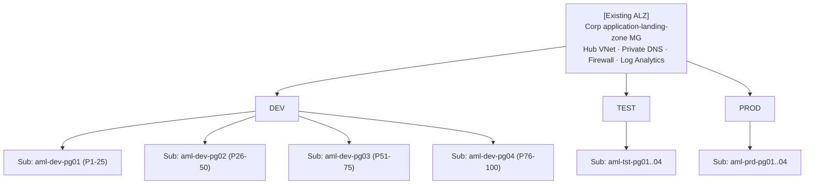

# Azure Machine Learning – Scale-Out Reference Architecture

Architecture pattern for scaling an Azure Machine Learning estate from a **single subscription** to multiple AML-dedicated subscriptions, **without re-designing the existing Azure Landing Zone** and **reusing the existing subscription-stamping pipeline**.

## Scenario

- **100 ML products × 3 environments (dev / test / prod)** → 300 AML workspaces.
- Each workspace has a **14-node batch compute cluster**; all workloads are **batch**.
- **Everything currently in one subscription** → hitting hard AML regional caps (100 endpoints, 2,500 compute targets, VM core quotas).

## Scope

| In scope | Out of scope (already in place) |
|---|---|
| AML workspaces, compute clusters, batch endpoints | Azure Landing Zones (MGs, policies, hub-and-spoke, central logging, identity) |
| ADLS Gen2, Key Vault, App Insights, ACR bound to AML | The organisation's existing **subscription-stamping pipeline** |
| AML-specific private endpoints + DNS zone links | Firewall, ExpressRoute, Sentinel, Defender |
| Product onboarding flow, quota operating model, naming | Tenant-level identity, Entra group governance |

This document defines the **AML stamp** — the AML-specific module set that the existing stamping pipeline must be extended with.

## TL;DR

- Vend **12 AML-dedicated subscriptions** (`4 product-groups × 3 environments`) under the existing Corp application-landing-zone MG.
- **25 products per subscription** → ≥ 4× headroom on every AML regional limit.
- Add **two new modules** to the existing stamping pipeline:
  - `aml-sub-shared` — runs once per subscription (shared ACR, DNS zone links, diagnostic routing).
  - `aml-product-stamp` — runs once per product per env (workspace + storage + KV + AI + 14-node cluster + batch endpoint + PEs).
- Prefer **batch endpoints** with multiple deployments per endpoint (≤ 20) to multiply model-version capacity without burning endpoint count.
- Scale to 200 / 400 / 1,000 products by vending more `pg*` subscriptions — design is linear.

## Target topology (AML-only view)



## Contents

Two reference architectures cover the same scenario from different angles. Pick by scale and operating model:

| | **v1 — Managed compute** | **v2 — AML on AKS** |
|---|---|---|
| Doc | [`docs/AML-Scale-Out-Architecture.md`](docs/AML-Scale-Out-Architecture.md) | [`docs/AML-AKS-ScaleOut-Architecture.md`](docs/AML-AKS-ScaleOut-Architecture.md) |
| Compute | Per-product `AmlCompute` 14-node clusters | Shared multi-tenant AKS clusters with the [AML extension](https://learn.microsoft.com/azure/machine-learning/how-to-attach-kubernetes-anywhere?view=azureml-api-2) (`KubernetesCompute`) |
| Subscriptions @ 100 products | 12 (4 PG × 3 env) | 3 (1 PG × 3 env) |
| Subscriptions @ 1,000 products | 120 (40 PG × 3 env) | **9 (3 PG × 3 env)** |
| Solves endpoint cap? | Partly (sub split) | Partly (sub split + multi-region) |
| Solves compute-target cap? | Partly | **Yes** — 1 attachment per workspace, unlimited namespaces |
| Solves VM core quota fan-out? | Per-sub raise per family | **Yes** — pooled into AKS node pools |
| Cost driver | Per-product compute, hard to share | **Pooled compute, spot pools, RIs on baseline** |
| Multi-region | Per-product re-stamp | AKS pair + AML Registry replication |
| Best for | < 300 products, single-region | **1,000+ products, cost-optimised, multi-region** |

Both documents include:
  - Scope and assumptions (ALZ + stamping pre-existing)
  - Why AML limits drive the design
  - Stamp definition (authoritative resource list)
  - Quota math
  - Splitting strategy, design principles
  - Implementation blueprint (how to extend the stamping pipeline)
  - Batch-workload tuning
  - Risks, mitigations
  - Scaling guidance
  - Microsoft Learn references
  - Decision log

The AKS variant additionally aligns to the [Well-Architected Framework guide for AML](https://learn.microsoft.com/azure/well-architected/service-guides/azure-machine-learning) and [MLOps v2](https://learn.microsoft.com/azure/architecture/ai-ml/guide/machine-learning-operations-v2).

For side-by-side **implementation effort** — technical foundation, per-product migration, and process/people change — see [`docs/AML-Implementation-Effort.md`](docs/AML-Implementation-Effort.md). It contains task-by-task tables for both designs (effort in person-days, elapsed time, persona/team, what changes, why, and risk), plus a comparison summary.

## Subscription and VNet peering minimisation

Both designs reuse the existing ALZ hub-and-spoke (one spoke per AML subscription), so **peering count tracks subscription count**. The v2 (AKS) design minimises both.

### Subscriptions

| Scale | v1 (managed) | v2 (AKS) | Reduction |
|---|---|---|---|
| 100 products | 12 | 3 | **4×** |
| 1,000 products | **120** | **9** | **~13×** |

Driver: pooling compute into shared AKS clusters removes the per-subscription compute-target and per-VM-family core-quota walls, so the only remaining sub-fan-out trigger is the 100-endpoint regional cap — which v2 also softens by pre-emptive raises and a paired-region split.

### VNet peerings (spoke ↔ hub)

| Scale | v1 peerings | v2 peerings |
|---|---|---|
| 100 products | 12 | 3 |
| 1,000 products | 120 | **9** (18 if the optional multi-region prod variant is taken) |

Specific levers in v2 that **avoid extra peerings**:

1. **Workspaces share the spoke with their AKS cluster** — no per-workspace VNet, so adding products is zero peerings.
2. **Reuse of ALZ-owned central Private DNS zones** (`privatelink.api.azureml.ms`, `privatelink.notebooks.azure.net`, ACR, Storage, KV) — `aml-sub-shared` only creates **zone links**, never new peerings.
3. **AML Registry** is reached over the existing hub PE; cross-sub model promotion does not add peerings.
4. **AKS API server VNet integration + private cluster** keeps control-plane traffic inside the spoke — no extra peering for kubectl or the AML extension.
5. **Egress through the existing ALZ Firewall** — no per-sub NAT gateway, no new transit peerings.
6. **Optional multi-region prod** uses the existing ALZ region pair plus an AML Registry for replication, not direct cross-region VNet peerings.

### Where it does not minimise further (and why)

- The 100-endpoint per-subscription-per-region cap is a control-plane limit AKS cannot lift, so going below 9 subs at 1,000 products requires either a Microsoft-approved endpoint raise or accepting fewer endpoints per product.
- One spoke per AML sub is unavoidable under the existing ALZ topology — collapsing them into one mega-spoke would re-introduce blast-radius and policy-scope problems and is out of scope (ALZ is pre-existing).

## Key Microsoft Learn references

- [Manage and increase quotas for Azure Machine Learning](https://learn.microsoft.com/azure/machine-learning/how-to-manage-quotas?view=azureml-api-2)
- [Azure Machine Learning service limits](https://learn.microsoft.com/azure/machine-learning/resource-limits-capacity?view=azureml-api-2)
- [Azure subscription and service limits](https://learn.microsoft.com/azure/azure-resource-manager/management/azure-subscription-service-limits)
- [AML as a data product for cloud-scale analytics](https://learn.microsoft.com/azure/cloud-adoption-framework/scenarios/cloud-scale-analytics/best-practices/azure-machine-learning)
- [Batch endpoints concept](https://learn.microsoft.com/azure/machine-learning/concept-endpoints-batch?view=azureml-api-2)
- [Quota Groups](https://learn.microsoft.com/azure/quotas/quota-groups)
- [Architecture best practices for AML (Well-Architected)](https://learn.microsoft.com/azure/well-architected/service-guides/azure-machine-learning)
- [MLOps v2 architecture](https://learn.microsoft.com/azure/architecture/ai-ml/guide/machine-learning-operations-v2)
- [Introduction to Kubernetes compute target in AML](https://learn.microsoft.com/azure/machine-learning/how-to-attach-kubernetes-anywhere?view=azureml-api-2)
- [Reference for configuring Kubernetes cluster for AML](https://learn.microsoft.com/azure/machine-learning/reference-kubernetes?view=azureml-api-2)

## Repository layout

```
.
├── README.md                                 # This file
└── docs/
    ├── AML-Scale-Out-Architecture.md         # v1 — managed AmlCompute design
    ├── AML-AKS-ScaleOut-Architecture.md      # v2 — AML on shared AKS, scales to 1,000+ products
    └── AML-Implementation-Effort.md         # Side-by-side effort, time, and people/process change for v1 and v2
```

## Viewing the diagrams

All diagrams are authored in **Mermaid** and render natively on GitHub.

## Contributing

1. Fork and branch (`feat/<short-topic>`).
2. Keep diagrams in Mermaid (no binary diagram files).
3. Link every design claim to Microsoft Learn where possible.
4. Update the **Decision log** in `docs/AML-Scale-Out-Architecture.md` when a principle changes.

## License

MIT — see `LICENSE` if present, otherwise treat content as MIT-licensed documentation.
