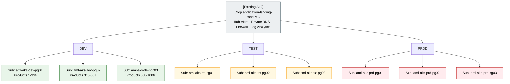
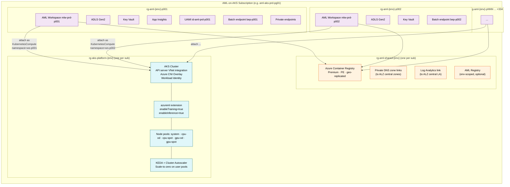
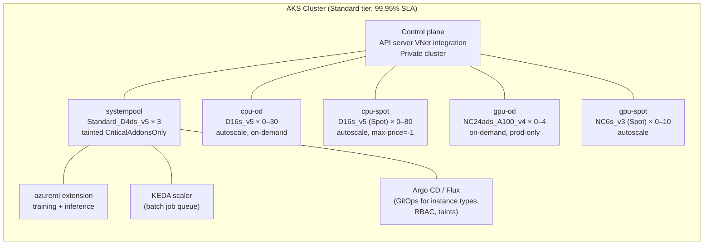
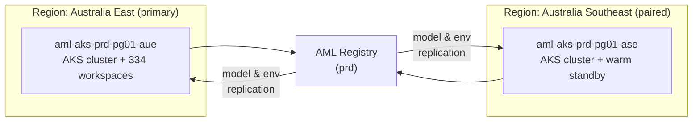
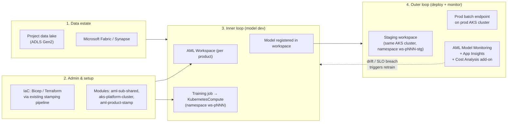

# Azure Machine Learning on AKS — Scale-Out Reference Architecture (1,000+ products)

> **Status:** Draft for review
> **Owner:** ML Platform Team
> **Last updated:** May 2026
> **Audience:** ML Platform Engineers, Cloud Architects, FinOps, AKS Platform Team
> **Primary region:** Australia East (`australiaeast` / `aue`) · **Secondary region (DR / endpoint-cap relief):** Australia Southeast (`australiasoutheast` / `ase`)
> **Companion to:** [`AML-Scale-Out-Architecture.md`](AML-Scale-Out-Architecture.md) (managed-compute variant)

---

## 0. Scope and assumptions

This document defines a **second reference architecture** for the same scenario as the managed-compute design, but optimised to:

- Scale to **1,000+ ML products × 3 environments** (≈ 3,000 workspaces' worth of workload).
- **Avoid the AML compute, endpoint, and core-quota walls** that force per-100-product subscription fan-out.
- Stay aligned to the [Azure Well-Architected Framework guide for AML](https://learn.microsoft.com/azure/well-architected/service-guides/azure-machine-learning) and [MLOps v2](https://learn.microsoft.com/azure/architecture/ai-ml/guide/machine-learning-operations-v2).
- Optimise **cost** by pooling compute across products instead of provisioning a 14-node cluster per product.

**Assumed in place (out of scope):** Azure Landing Zones (MGs, hub-and-spoke, central logging, identity, policy), the existing subscription-stamping pipeline, ExpressRoute, Firewall, Sentinel, Defender, Entra/PIM, central Log Analytics, central Private DNS zones.

**In scope:** AML workspaces, AKS platform clusters with the **Azure Machine Learning extension** (`KubernetesCompute`), AML-bound ADLS / KV / ACR / App Insights, instance types / taints / tolerations, network isolation, the operating model that lets one AKS cluster back **dozens of workspaces**, and the subscription split needed at 1,000 products.

---

## 1. Executive summary

The managed-compute design (v1) hits AML's **per-subscription regional walls** — 100 endpoints, 500 deployments, 2,500 compute targets, and per-VM-family core quotas — and so requires **12 subscriptions at 100 products** and **120 subscriptions at 1,000 products**. The cost driver at that scale is not just subscriptions, it is that **every product owns an isolated 14-node `AmlCompute` cluster** that cannot share capacity with any other product.

This v2 design replaces per-product `AmlCompute` with a small set of **shared, multi-tenant AKS "platform" clusters** attached to AML via the [Azure Machine Learning Kubernetes extension](https://learn.microsoft.com/azure/machine-learning/how-to-attach-kubernetes-anywhere?view=azureml-api-2). Workspaces remain per-product (governance, RBAC, lineage), but **compute is pooled** across products via Kubernetes namespaces, **instance types** ([CRDs](https://learn.microsoft.com/azure/machine-learning/how-to-manage-kubernetes-instance-types?view=azureml-api-2)), and **AML-aware taints/tolerations** ([reference](https://learn.microsoft.com/azure/machine-learning/reference-kubernetes?view=azureml-api-2#supported-azure-machine-learning-taints-and-tolerations)).

**Result at 1,000 products:**

| Dimension | v1 (managed compute) | v2 (AML on AKS) |
|---|---|---|
| AML subscriptions | **120** (40 PG × 3 env) | **9** (3 PG × 3 env) |
| Per-sub compute targets | 25 `AmlCompute` clusters | **1–3 KubernetesCompute attachments** (multi-tenant) |
| Per-sub VM core quota fan-out | Hard ceiling each sub | **Pooled into AKS node pools** — one quota request per cluster |
| Per-sub endpoints | 25 batch | 100–115 batch (cap-bound; still drives sub split) |
| Per-product compute baseline cost | 14-node cluster, scale-to-zero with cold start | **Zero** baseline; bursts into shared pool |
| GPU sharing | Impossible across products | **Yes** (per-namespace GPU instance types) |
| Multi-region failover | Per-product re-deploy | AKS cluster pair per region with fleet manager |

The endpoint cap is still per-subscription (it is a control-plane limit, not a compute one), so a small subscription split is still required — but **3 product-groups per environment** instead of 40 is enough to keep endpoint utilisation under 75 %.

---

## 2. What this design does and does not change vs. v1

| Concern | v1 (managed compute) | v2 (AML on AKS) |
|---|---|---|
| Workspace per product per env | ✅ Yes | ✅ Yes (unchanged — preserves MLOps v2 RBAC + lineage) |
| Compute target per product | ✅ Per product (`AmlCompute`) | ❌ **Shared** `KubernetesCompute` per env per region |
| Endpoint count per product | 1 batch (≤ 20 deployments) | 1 batch and/or 1 Kubernetes online (`scoring-fe`) |
| Core quota driver | Per-subscription per family | Per-subscription per family **but pooled in AKS** |
| Subscription fan-out trigger | Endpoints, targets, **and** cores | **Mostly endpoints only** |
| Cold-start latency | Image pull on every cluster scale-up | Image pre-pulled on AKS node pools |
| Spot / low-priority | Per-cluster opt-in | Cluster-wide spot node pool, scheduled per workload |
| Multi-region | Re-stamp in second region | Cluster pair + AML registry replication |
| Stamping pipeline | Two new modules (`aml-sub-shared`, `aml-product-stamp`) | **Three** (`aml-sub-shared`, `aks-platform-cluster`, `aml-product-stamp`) |

The product onboarding flow, naming convention, and "no `env` field on intake" rule from v1 are preserved.

---

## 3. Why AKS-based compute lifts the quota walls

| Limit (per sub, per region) | Default | Hit by v1 (per sub @ 25 prods) | Hit by v2 (per sub @ 100 prods) | Why v2 helps |
|---|---|---|---|---|
| **Compute targets** | 500 (max 2,500) | 25 `AmlCompute` clusters | **1–3** `KubernetesCompute` attachments | A single AKS cluster can be attached to many workspaces and back unlimited namespaces |
| **VM cores per family** | 24–300 (raise via ticket) | 25 × 14 nodes per family | One pooled allocation for the AKS node pool | Single quota raise per cluster, not 25 |
| **Endpoints (online + batch)** | 100 | 25 | **100–115** (still cap-bound) | Not solved by AKS — endpoint count is a control-plane object in the workspace |
| **Deployments (online + batch)** | 500 | 25–500 | 100–500 | Same — control-plane object |
| **Deployments per endpoint** | 20 | Up to 20 | Up to 20 | Unchanged |
| **Workspaces per sub** | No hard limit | 25 | 100 | Unchanged |
| **AKS clusters per sub** | 5,000 | n/a | 2–4 (per env) | Comfortably below limit |
| **AKS nodes per cluster** | 5,000 (Standard tier) | n/a | Sized to peak workload | See §6 |

> **Endpoint cap is the only AML limit AKS does not solve.** It still drives a smaller subscription split (3 product-groups per env at 1,000 products instead of 40). But the dominant cost and operational pain — per-product compute fan-out and core quotas — is removed.

Sources: [Manage AML quotas](https://learn.microsoft.com/azure/machine-learning/how-to-manage-quotas?view=azureml-api-2), [AML service limits](https://learn.microsoft.com/azure/machine-learning/resource-limits-capacity?view=azureml-api-2), [AKS quotas and regional limits](https://learn.microsoft.com/azure/aks/quotas-skus-regions).

---

## 4. Target topology

### 4.1 Subscription fan-out (3 product-groups per env at 1,000 products)



**Totals:** **9 AML-dedicated subscriptions** at 1,000 products (vs. 120 in v1). Each holds ≈ 334 product workspaces + 1 platform AKS cluster pair.

| Limit per sub @ 334 products | Value | % of cap |
|---|---|---|
| Batch endpoints (1 per product) | 334 | **Exceeds 100 cap** → see §4.4 below |
| Compute targets | 1–3 (AKS attachments) | < 1 % |
| Workspaces | 334 | unbounded |
| AKS clusters | 2 (active + warm-standby for HA) | < 1 % |

### 4.2 Inside one AML subscription — workspaces share AKS



**Key shift vs. v1:** the per-product `AmlCompute` is gone. Each product workspace **attaches** to the same shared AKS cluster as a `KubernetesCompute` target, scoped to its own namespace. The AKS cluster does the elastic compute work.

### 4.3 The AML-on-AKS stamp

| Resource | Sharing scope | Notes |
|---|---|---|
| AML Workspace | Per product per env | Unchanged from v1 |
| ADLS Gen2 (workspace default) | Per product per env | Unchanged |
| Key Vault | Per product per env | Unchanged |
| Application Insights | Per product per env | Unchanged |
| User-assigned managed identity | Per product per env | Unchanged |
| Batch endpoint (default) | Per product per env | Targets `KubernetesCompute` instead of `AmlCompute` |
| Private endpoints (WS / ST / KV / ACR) | Per product per env | Unchanged |
| **`KubernetesCompute` attachment** | **Per product per env** | One attachment per workspace, namespace = `ws-p{nnn}` |
| **AKS cluster + AML extension** | **Per env per sub (shared)** | Hosts compute for all products in the subscription |
| **Instance type CRDs** | **Per env per sub (shared)** | E.g. `cpu-small`, `cpu-large`, `gpu-a100`, `gpu-spot` |
| **Node pools** | **Per env per sub (shared)** | system / cpu-od / cpu-spot / gpu-od / gpu-spot |
| Shared ACR | Per sub | Premium, PE-enabled, geo-replicated for prod |
| Private DNS zone links | Per sub | Reuses ALZ-owned zones |
| AML Registry (optional) | Per env (cross-sub) | Cross-workspace model promotion |

### 4.4 Endpoint cap mitigation at 334 products per sub

The 100-endpoint per-sub-per-region cap is the only AML quota that AKS does not lift. Three layered mitigations:

1. **One workspace per product can comfortably host 1 batch endpoint** with up to 20 deployments. At 334 products this still requires 334 endpoints per sub.
2. **File a [request for endpoint limit increase](https://learn.microsoft.com/azure/machine-learning/how-to-manage-quotas?view=azureml-api-2#endpoint-limit-increases)** at vend time. Microsoft routinely approves raises to several hundred endpoints per subscription per region for batch-only estates.
3. **Multi-region** — split product groups across **Australia East** (primary) and **Australia Southeast** (paired). The 100-endpoint cap is per **region** per sub, so a single subscription comfortably holds 200+ endpoints when products are evenly placed across both Australian regions, while preserving in-country data residency.

If neither raise nor multi-region is acceptable, fall back to **6 product-groups per env (18 subs total)** instead of 3 — still 7× fewer subs than v1.

---

## 5. AKS platform-cluster design

### 5.1 Cluster blueprint per env per sub



**Sizing rules of thumb (per environment, per subscription, per region):**

| Pool | Purpose | Min | Max | SKU example |
|---|---|---|---|---|
| `systempool` | Extension components, KEDA, ingress | 3 | 5 | `Standard_D4ds_v5` |
| `cpu-od` | SLA-bound batch, training pinned to dedicated | 0 | 30 | `Standard_D16s_v5` |
| `cpu-spot` | Best-effort batch, dev/test | 0 | 80 | `Standard_D16s_v5` (Spot) |
| `gpu-od` | Production GPU training/inference | 0 | 4 | `Standard_NC24ads_A100_v4` |
| `gpu-spot` | Experimentation, low-priority training | 0 | 10 | `Standard_NC6s_v3` (Spot) |

Min=0 and Cluster Autoscaler ensure **zero baseline cost** for user pools when idle. The system pool is the only always-on cost.

### 5.2 Multi-tenancy controls — namespace per workspace

When the stamping pipeline attaches a workspace to the AKS cluster, it **creates a dedicated Kubernetes namespace** named `ws-p{nnn}` and applies:

| Control | Mechanism |
|---|---|
| Isolation | Kubernetes namespace + NetworkPolicy denying cross-namespace traffic |
| RBAC inside cluster | Workspace's UAMI bound to a `Role` in its namespace only |
| Storage | PVCs labelled `ml.azure.com/pvc: "true"` for product-specific data |
| Node affinity | AML taints: `ml.azure.com/workspace=mlw-{env}-p{nnn}:NoSchedule` on dedicated pools (when used) |
| Quotas | `ResourceQuota` per namespace (CPU, memory, GPU, pod count) |
| Secrets | Workspace's Key Vault accessed via Workload Identity from inside the namespace |

Reference: [AML-aware Kubernetes taints and tolerations](https://learn.microsoft.com/azure/machine-learning/reference-kubernetes?view=azureml-api-2#supported-azure-machine-learning-taints-and-tolerations).

### 5.3 Instance types — the data-scientist-facing contract

Instance types are CRDs the platform team curates once per cluster. Data scientists pick by **name**; they never see SKUs.

```yaml
# Example: cpu-large, requested by data scientists in job YAML
apiVersion: amlarc.azureml.com/v1alpha1
kind: InstanceType
metadata:
  name: cpu-large
spec:
  nodeSelector:
    agentpool: cpu-od
  resources:
    requests:
      cpu: "8"
      memory: "32Gi"
    limits:
      cpu: "16"
      memory: "60Gi"
```

Curated catalogue per cluster (recommended starter set):

| Instance type | Pool | Use |
|---|---|---|
| `cpu-small` | `cpu-spot` | Dev/test batch |
| `cpu-medium` | `cpu-spot` | Default batch jobs |
| `cpu-large` | `cpu-od` | SLA-bound prod batch |
| `gpu-small-spot` | `gpu-spot` | Experimentation |
| `gpu-large` | `gpu-od` | Prod training/inference |

### 5.4 Network isolation

- **Private cluster** + [API server VNet integration](https://learn.microsoft.com/azure/aks/api-server-vnet-integration) — control plane reachable only via the spoke VNet.
- **Azure CNI Overlay** to keep VNet IP usage low at 1,000 products.
- **AML workspace** kept on `AllowOnlyApprovedOutbound` (managed VNet), with the AKS PE in the approved list.
- **`azureml-fe` ingress** stays internal only; external scoring calls go through APIM or App Gateway in the ALZ hub.
- **Egress** through the ALZ Firewall — no NAT gateway on the AKS cluster.

Reference: [Configure private endpoint for AML workspace](https://learn.microsoft.com/azure/machine-learning/how-to-configure-private-link?view=azureml-api-2), [AML extension deployment](https://learn.microsoft.com/azure/machine-learning/how-to-deploy-kubernetes-extension?view=azureml-api-2).

---

## 6. Quota math — v1 vs. v2 at 1,000 products

| Limit | Default | v1 (120 subs) per sub | v2 (9 subs) per sub |
|---|---|---|---|
| Endpoints / region | 100 | 25 (25 %) | 334 — **needs raise or 2-region** |
| Deployments / region | 500 | 25 – 500 | 334 – 6,680 — **batch-cap mostly** |
| Compute targets / region | 500 (max 2,500) | 25 (5 %) | **1–3** (< 1 %) |
| VM cores per family | 24 – 300 | 25 × 14 × cores | **One pool** sized to peak across products |
| Workspaces | unbounded | 25 | 334 |
| AKS clusters | 5,000 | 0 | 2 |

**The v2 design moves the bottleneck from compute to control-plane endpoint count**, which is far easier to manage (one quota raise per sub vs. one quota raise per VM family per sub).

---

## 7. Cost model and optimisation levers

### 7.1 Where v2 saves money

The dominant v1 cost at 1,000 products is **per-product `AmlCompute` clusters that cannot share capacity**. Even with `min_instances=0`, every product team eventually keeps a baseline running, and peak demand is rarely simultaneous across products.

| Cost lever | v1 | v2 | Saving driver |
|---|---|---|---|
| Baseline compute when idle | Per-product image cache + occasional warm node | **Zero** on user pools | Cluster Autoscaler scales user pools to 0 |
| Peak compute | 1,000 × 14 = 14,000 nodes worst case | Pool of 60–120 nodes per sub bursting to ~150 | Statistical multiplexing — products do not all peak together |
| Spot eligibility | Per product opt-in | Cluster-wide spot pool default for dev/test/exploration | Spot saves 60 – 90 % vs. PAYG ([Spot pricing](https://azure.microsoft.com/pricing/spot-advisor/)) |
| Reserved instances | Hard to apply (per-product clusters churn) | Apply 1- or 3-yr **Savings Plan / RI** to baseline `cpu-od` and `systempool` | Up to 65 % vs. PAYG for steady baseline |
| GPU sharing | Impossible | NVIDIA MIG + Kubernetes [time-slicing](https://learn.microsoft.com/azure/aks/gpu-multi-instance) on `gpu-od` | One A100 serves multiple low-utilisation products |
| Subscription overhead | 120 subs × shared ACR + Log Analytics ingest | 9 subs | ACR + LA ingest fan-out cost cut 13× |
| Data egress | Cross-sub PE-routed traffic | In-cluster within sub | Less hub-spoke peering traffic |

### 7.2 Cost dimensions to plug into the [Azure Pricing Calculator](https://azure.microsoft.com/pricing/calculator/)

> Concrete prices are not given here because they vary by region, currency, commitment, and time. Use these as inputs:

- **AKS Standard tier**: ~ $0.10/hr per cluster (control plane) → ~ $73/mo per cluster.
- **System pool**: 3 × `D4ds_v5` always on per cluster.
- **User pools (cpu-od)**: size to **expected concurrent peak** across all products in the sub (modelled at 5 – 15 % of theoretical max).
- **User pools (cpu-spot)**: size to **expected concurrent batch demand** at 70 – 90 % discount.
- **Reserved capacity**: apply 1-yr Reserved Instances or Savings Plan to system pool + 50 % of `cpu-od` baseline.
- **ACR Premium per sub**: ~ $1.66/day = ~ $50/mo, plus geo-replication for prod.
- **App Insights ingest per workspace**: budget per product, set sampling.
- **ADLS per workspace**: Cool/Cold tiering for old job artifacts via [lifecycle management](https://learn.microsoft.com/azure/storage/blobs/lifecycle-management-overview).

### 7.3 FinOps controls

| Control | Where | Scope |
|---|---|---|
| Per-namespace `ResourceQuota` | AKS cluster | Per product, prevents one product from starving another |
| Per-namespace cost allocation | [AKS Cost Analysis add-on](https://learn.microsoft.com/azure/aks/cost-analysis) + Cost Management | Per product chargeback |
| Budget alerts | Cost Management, per RG | Per product workspace + per AKS cluster |
| Spot eviction policy | Workload tolerations | Dev/test default to spot; prod opt-in only |
| Idle namespace reaper | Custom controller / cron | Decommission namespaces with 0 jobs for 30 d |
| `min_instances=0` on every user pool | AKS Cluster Autoscaler | Universal |

---

## 8. Multi-region for resilience and capacity



- **Active / warm-standby AKS pair** per product-group sub for prod (control plane separate; node pools warm at min only).
- **AML Registry** ([docs](https://learn.microsoft.com/azure/machine-learning/how-to-manage-registries?view=azureml-api-2)) per env at the platform sub level — promotes models, environments, and components across workspaces and regions.
- **ADLS / Storage**: GRS or RA-GRS for prod artifact stores; product data lake replication is owned by the data-platform team.
- **DR runbook**: failover = re-target the batch endpoint deployment to the standby cluster; no model re-train needed.
- This also **lifts the 100-endpoint regional cap** by spreading endpoints across the two paired Australian regions (Australia East and Australia Southeast).

---

## 9. MLOps v2 alignment

The four MLOps v2 phases ([reference](https://learn.microsoft.com/azure/architecture/ai-ml/guide/machine-learning-operations-v2)) all map cleanly onto this design:



| MLOps v2 design point | Where in this architecture |
|---|---|
| Use Bicep/Terraform from the infra team | `aml-product-stamp` + `aks-platform-cluster` modules, called from existing pipeline |
| One workspace per project / per env | Per product per env (unchanged from v1) |
| Network isolation (managed VNet, PEs, `AllowOnlyApprovedOutbound`) | Workspace + AKS private cluster + ALZ Firewall |
| Model registry for cross-workspace promotion | AML Registry per env |
| Curated environments + ACR vulnerability scan + Defender for Containers | Shared per-sub Premium ACR; Defender for Containers enabled on AKS |
| Persona-based RBAC (data scientist, ML engineer, platform support) | Workspace-level RBAC + Kubernetes namespace RBAC |
| Model & data drift monitoring | [AML Model Monitoring](https://learn.microsoft.com/azure/machine-learning/concept-model-monitoring) + App Insights |
| Endpoint observability | App Insights + Azure Monitor metrics on AKS + AML online endpoint logs |
| Cost monitoring per workspace | Cost Management budgets + AKS Cost Analysis add-on per namespace |

WAF pillar mapping ([service guide](https://learn.microsoft.com/azure/well-architected/service-guides/azure-machine-learning)):

| Pillar | How v2 satisfies it |
|---|---|
| **Reliability** | AKS supports availability zones + multi-region; checkpointing on training jobs; AML Registry for failover; Dedicated tier for SLA-bound batch ([guidance](https://learn.microsoft.com/azure/well-architected/service-guides/azure-machine-learning#reliability)) |
| **Security** | Private cluster, managed VNet on workspace, `AllowOnlyApprovedOutbound`, Workload Identity (no static creds), CMK on workspace, Defender for Containers, no public IPs on nodes |
| **Cost Optimization** | Pooled compute, spot pools, Cluster Autoscaler scale-to-zero, Reserved Instances on baseline, idle shutdown, spot for non-SLA batch |
| **Operational Excellence** | IaC via existing stamping, GitOps for cluster config, App Insights on endpoints, model & data drift monitoring, curated environments |
| **Performance Efficiency** | Right-sized instance types per workload, GPU MIG / time-slicing, autoscale on AKS, bursting into spot pool for parallel batch |

---

## 10. Implementation blueprint — extending the stamping pipeline

Three modules are added to the existing pipeline (one more than v1):

| Module | Scope | When it runs | Approx. time |
|---|---|---|---|
| `aml-sub-shared` | Per AML subscription | Once after sub vending | 8 min |
| `aks-platform-cluster` | Per env per sub (per region for prod) | Once after `aml-sub-shared` | 25 min (cluster + extension) |
| `aml-product-stamp` | Per product per env | On product onboarding | 12 min |

### 10.1 `aks-platform-cluster` responsibilities

1. Create AKS cluster (private, API server VNet integration, Workload Identity, OIDC issuer, Azure CNI Overlay, system pool only).
2. Add `cpu-od`, `cpu-spot`, `gpu-od`, `gpu-spot` node pools with `min_count=0`.
3. Install [Azure Machine Learning extension](https://learn.microsoft.com/azure/machine-learning/how-to-deploy-kubernetes-extension?view=azureml-api-2) with `enableTraining=true enableInference=true`.
4. Apply curated `InstanceType` CRDs.
5. Apply baseline NetworkPolicies, default `ResourceQuota` template.
6. Bootstrap GitOps (Argo CD or Flux) to manage instance types, taints, and per-namespace policies as code.
7. Enable [AKS Cost Analysis add-on](https://learn.microsoft.com/azure/aks/cost-analysis) for per-namespace chargeback.
8. Wire diagnostic settings → ALZ Log Analytics.
9. Defender for Containers enable.

### 10.2 `aml-product-stamp` differences from v1

The v1 list (workspace, ADLS, KV, AI, UAMI, batch endpoint, PEs) is unchanged, except:

- **Remove** the `AmlCompute` 14-node cluster.
- **Add** an `attach-kubernetes-compute` step that:
  - Creates a Kubernetes namespace `ws-p{nnn}` on the platform cluster.
  - Applies a `ResourceQuota` and `NetworkPolicy` for the namespace.
  - Calls `az ml compute attach --type Kubernetes --resource-id <aks-id> --namespace ws-p{nnn} --identity-type UserAssigned --user-assigned-identities <uami-id>`.
  - Registers the compute target name `aks-shared-{env}` in the workspace.
- **Default instance type** for the product's batch endpoint = `cpu-medium` (data scientist can override).

### 10.3 Worked onboarding example — Product 501

```
Allocator: pg_index = ceil(501 / 334) = 2  →  sub-aml-aks-{env}-pg02
For each env [dev, tst, prd]:
  - sub already exists  → skip step 1–4
  - aks-platform-cluster already exists → skip step 5
  - aml-product-stamp:
     - rg-aml-{env}-p501 created
     - workspace mlw-{env}-p501-aue provisioned
     - dependent ADLS / KV / AI / UAMI / PEs provisioned
     - Kubernetes namespace ws-p501 created on aks-{env}-pg02-aue
     - ResourceQuota: 32 CPU, 128Gi memory, 1 GPU, 50 pods
     - workspace attached as KubernetesCompute "aks-shared-{env}"
     - batch endpoint bep-p501 created targeting "aks-shared-{env}", instance type cpu-medium
```

End-to-end ≈ 12 min per env; runs in parallel across dev/tst/prd.

---

## 11. Risks, trade-offs, and mitigations

| Risk | Impact | Mitigation |
|---|---|---|
| **Noisy-neighbour** in shared AKS | Moderate | Per-namespace `ResourceQuota` + `LimitRange`; dedicated `cpu-od` pool for SLA-bound prod with workspace-name taint |
| **AKS extension scope** is per cluster | Low | Documented N-2 Kubernetes version policy ([reference](https://learn.microsoft.com/azure/machine-learning/reference-kubernetes?view=azureml-api-2#supported-kubernetes-version-and-region)); upgrade in green-blue cluster pairs |
| **GPU spot evictions** mid-job | Moderate | Use checkpointing + `gpu-od` for SLA-bound runs; spot only for experimentation |
| Endpoint cap still hit per sub | High at 334 | Pre-file endpoint raise at sub vend; multi-region for prod; fall back to 6 PG instead of 3 if denied |
| **AKS upgrade blast radius** vs. v1 isolated `AmlCompute` | High | Blue-green cluster pair; drain workspaces by re-attaching to standby cluster (compute target swap is workspace-level only) |
| **Kubernetes online endpoint limitations** vs. managed online | Moderate | Foundation models from Model Catalog **not** supported on K8s online endpoints; use managed online endpoints in a small "managed-endpoints" sub for those rare cases ([reference](https://learn.microsoft.com/azure/machine-learning/how-to-attach-kubernetes-anywhere?view=azureml-api-2#limitations-for-kubernetes-compute-target)) |
| **Training auto-scale not supported** on K8s training | Low | Use parallel job patterns; size cluster pool to peak; use spot for cost |
| Operational complexity of AKS + AML extension | Moderate | Dedicated AKS platform team; GitOps for declarative cluster state; AKS Automatic mode where appropriate |
| AML CLI v1 `AksCompute` legacy still in use | Migration risk | CLI v1 ended Sept 2025; SDK v1 ends June 2026 — migrate to `KubernetesCompute` per [migration guidance](https://learn.microsoft.com/azure/machine-learning/how-to-attach-kubernetes-anywhere?view=azureml-api-2#comparison-of-kubernetescompute-and-legacy-akscompute-targets) |
| Cluster image / extension upgrade window | Moderate | Maintenance windows aligned with AML extension biweekly release cadence |

---

## 12. Scaling beyond 1,000 products

This design is linear in **AKS cluster pairs**, not subscriptions.

| Products | Subscriptions | AKS clusters per env | Comment |
|---|---|---|---|
| 100 | 3 (1 PG × 3 env) | 1 per env | Endpoint cap not yet binding |
| 500 | 6 (2 PG × 3 env) | 2 per env | One quota raise per sub |
| **1,000** | **9 (3 PG × 3 env)** | **3 per env** (or 6 across 2 regions) | **Baseline target of this doc** |
| 2,500 | 24 (8 PG × 3 env) | 8 per env (multi-region) | Add second AML Registry, expand spot pools |
| 5,000+ | Per region replicate; consider [AKS Fleet Manager](https://learn.microsoft.com/azure/kubernetes-fleet/overview) for cross-cluster orchestration | n/a | Pre-warm capacity reservations for GPU |

Early-warning thresholds (emit from stamping pipeline):

- Workspaces in a sub ≥ **300** (90 % of 334 budget) → vend next product-group sub.
- Endpoints in a sub ≥ **75** of cap → file raise or split product-group to Australia Southeast.
- Any node pool max sustained > **80 %** for > 1 day → scale max-count or add a node pool.
- AML extension version drift > 2 minor versions → schedule cluster upgrade.
- Cost per product per month above a target threshold → review `ResourceQuota` and instance-type catalogue.

---

## 13. Reference links

### AML on Kubernetes
- [Introduction to Kubernetes compute target](https://learn.microsoft.com/azure/machine-learning/how-to-attach-kubernetes-anywhere?view=azureml-api-2)
- [Deploy the Azure Machine Learning extension](https://learn.microsoft.com/azure/machine-learning/how-to-deploy-kubernetes-extension?view=azureml-api-2)
- [Attach Kubernetes cluster to workspace](https://learn.microsoft.com/azure/machine-learning/how-to-attach-kubernetes-to-workspace?view=azureml-api-2)
- [Reference for configuring Kubernetes cluster](https://learn.microsoft.com/azure/machine-learning/reference-kubernetes?view=azureml-api-2)
- [Create and manage instance types](https://learn.microsoft.com/azure/machine-learning/how-to-manage-kubernetes-instance-types?view=azureml-api-2)

### Quotas and limits
- [Manage and increase quotas for AML](https://learn.microsoft.com/azure/machine-learning/how-to-manage-quotas?view=azureml-api-2)
- [AML service limits](https://learn.microsoft.com/azure/machine-learning/resource-limits-capacity?view=azureml-api-2)
- [AKS quotas, virtual machine size restrictions, and region availability](https://learn.microsoft.com/azure/aks/quotas-skus-regions)
- [Quota Groups](https://learn.microsoft.com/azure/quotas/quota-groups)

### Architecture & WAF
- [Architecture best practices for AML (WAF)](https://learn.microsoft.com/azure/well-architected/service-guides/azure-machine-learning)
- [MLOps v2 architecture](https://learn.microsoft.com/azure/architecture/ai-ml/guide/machine-learning-operations-v2)
- [AML as a data product for cloud-scale analytics](https://learn.microsoft.com/azure/cloud-adoption-framework/scenarios/cloud-scale-analytics/best-practices/azure-machine-learning)
- [AML Registry](https://learn.microsoft.com/azure/machine-learning/how-to-manage-registries?view=azureml-api-2)

### AKS platform
- [AKS Standard tier SLA](https://learn.microsoft.com/azure/aks/free-standard-pricing-tiers)
- [API server VNet integration](https://learn.microsoft.com/azure/aks/api-server-vnet-integration)
- [Azure CNI Overlay](https://learn.microsoft.com/azure/aks/azure-cni-overlay)
- [Workload Identity](https://learn.microsoft.com/azure/aks/workload-identity-overview)
- [Cluster Autoscaler](https://learn.microsoft.com/azure/aks/cluster-autoscaler)
- [GPU multi-instance (MIG)](https://learn.microsoft.com/azure/aks/gpu-multi-instance)
- [AKS Cost Analysis add-on](https://learn.microsoft.com/azure/aks/cost-analysis)
- [AKS Fleet Manager](https://learn.microsoft.com/azure/kubernetes-fleet/overview)
- [Spot virtual machines](https://learn.microsoft.com/azure/virtual-machines/spot-vms)

---

## 14. Decision log

| # | Decision | Rationale |
|---|---|---|
| K1 | Use `KubernetesCompute` (AML extension on AKS) instead of `AmlCompute` for all products | Removes per-sub compute-target and per-VM-family core-quota fan-out; pools peak demand across products |
| K2 | Keep one workspace per product per env (unchanged from v1) | MLOps v2 governance, lineage, persona RBAC, blast-radius unaffected by compute pooling |
| K3 | One shared AKS cluster pair per env per sub (per region for prod) | Simplest mapping of subscription → cluster; fewer control planes; fits the 5,000-cluster-per-sub headroom comfortably |
| K4 | Dedicated namespace per workspace (`ws-p{nnn}`) on the shared cluster | Standard Kubernetes isolation primitive; integrates with `ResourceQuota`, NetworkPolicy, AML taints |
| K5 | Subscription split = 3 product-groups × 3 envs at 1,000 products (9 subs total) | Driven by endpoint cap (still per-sub-per-region); 13× fewer subs than v1 |
| K6 | File pre-emptive endpoint-cap raises on prod subs and use Australia Southeast as paired region | Endpoint count is the only AML quota AKS does not lift; the in-country pair is also DR-positive and preserves data residency |
| K7 | Spot node pools default for dev/test and exploration; on-demand only for SLA-bound prod | 60 – 90 % cost saving; matches WAF Cost Optimization low-priority guidance |
| K8 | Reserved Instances or Savings Plan on system pool + 50 % of `cpu-od` baseline | Predictable baseline → up to 65 % saving |
| K9 | Cluster Autoscaler with `min=0` on every user pool | Idle-cost approaches AKS control plane only |
| K10 | GitOps (Argo CD / Flux) for instance types, RBAC, and namespace policies | Declarative, auditable, replayable across cluster pairs and regions |
| K11 | AML Registry per env at platform sub level | Cross-sub model + environment promotion; enables multi-region DR |
| K12 | Defender for Containers + Azure Policy for AKS + AKS Cost Analysis add-on | WAF Security + Cost Optimization pillars; per-namespace chargeback |
| K13 | Do not use the legacy `AksCompute` target | CLI v1 ended Sept 2025, SDK v1 ends June 2026; only `KubernetesCompute` has active feature roadmap |
